# [Java-ThreadLocal](https://www.imooc.com/learn/1217)

一致性问题

1. 发生在多个主体对同一份数据无法达成共识。
2. 包括：分布式一致性问题、并发问题等。
3. 特点：场景多、问题复杂、难以察觉---需要严密的思考甚至数学论证。

一致性问题解决办法

1. 排队（例如：锁、互斥量、管程、屏障等）
2. 投票（例如：Paxos，Raft 等）
3. 避免（例如：ThreadLocal 等 空间换时间的方式）

<!-- 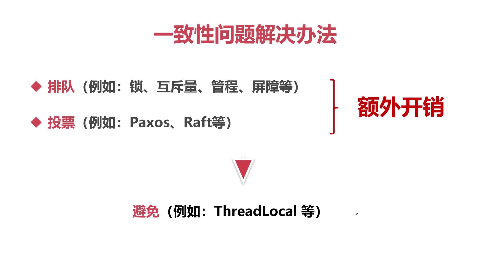 -->

工作要求

- P4~P5 初中级了解基本概念、原理（**在别人做好的基础上开发**）
- P6 高级应对不同场景、正确使用、结果可预期（**了解毎种数据结构的正确使用姿势，以及为什么要用**）
- P7 专家、高专深度掌握原理、本质、可改进、可定制（**为什么要有某种数据结构，以及这种数据结构为什么要有这样的内部实现？**）

<!-- 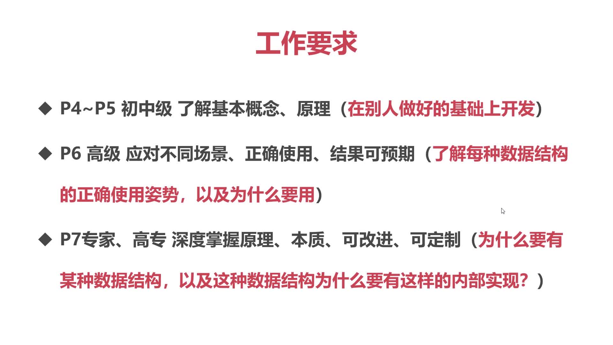 -->

内容

- P4~P5 介绍基础 API
- P6 介绍若干个关键使用场景，分析每个场景使用 `ThreadLocal` 的作用和必要性
- P7 专家带你手写实现一个 `ThreadLocal` 并帮助分解其中每个细节设计背后的原理

<!-- 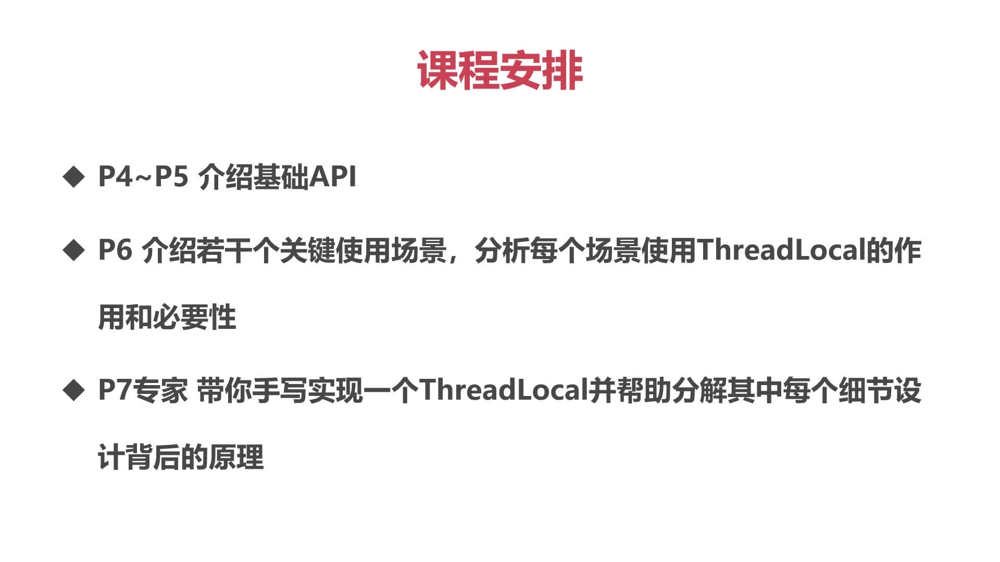 -->

总结

- 问题多不是坏事，这让程序员更有价值——我们的生存空间。
- 做长远的学习计划，以终为始，将一致性问题一网打尽—我们的应对策略。
- 重视本质学习是成为专家的必经之路。

<!-- 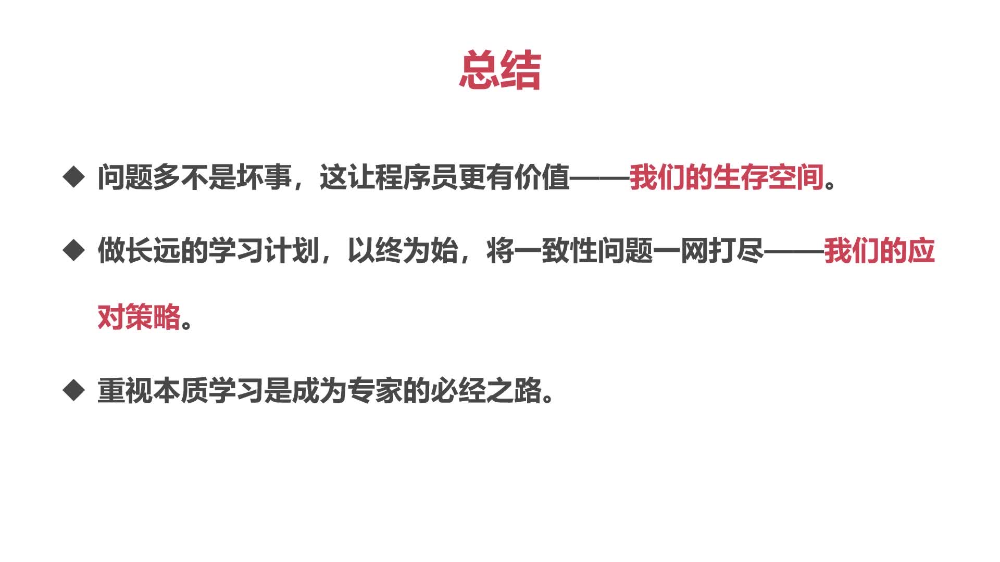 -->

## 1. 什么是 ThreadLocal

定义：提供**线程局部**变量；一个线程局部变量在多个线程中，分别有独立的值（副本）。

特点：简单（开箱即用）、快速（无额外开销）、安全（线程安全）

场景：多线程场景（资源持有、线程一致性、并发计算、线程安全等场景）

<!-- 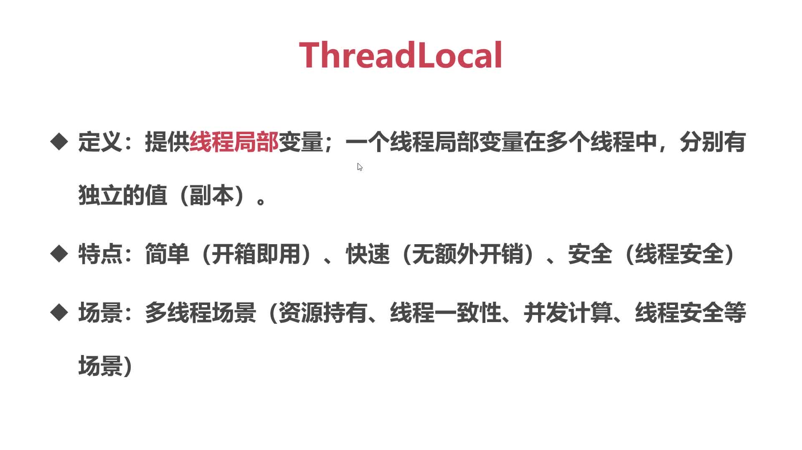 -->

实现原理：Java 中用**哈希表**实现。

应用范围：几乎**所有**提供多线程特征的语言。

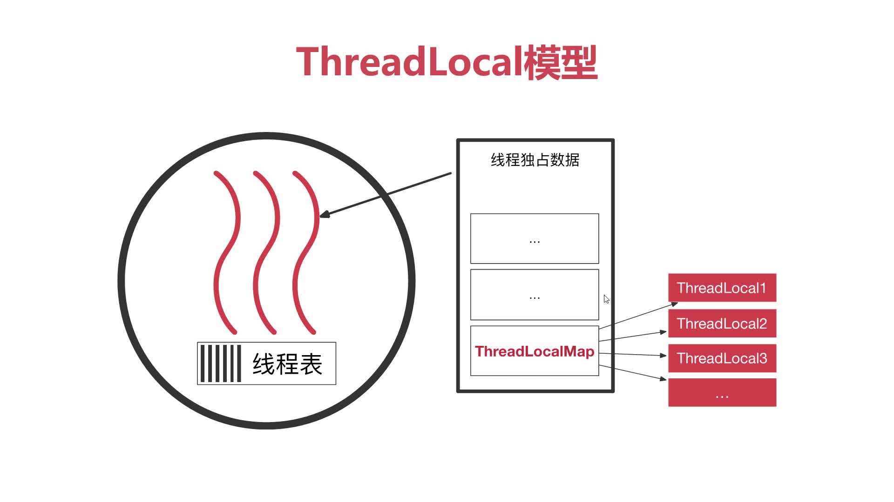

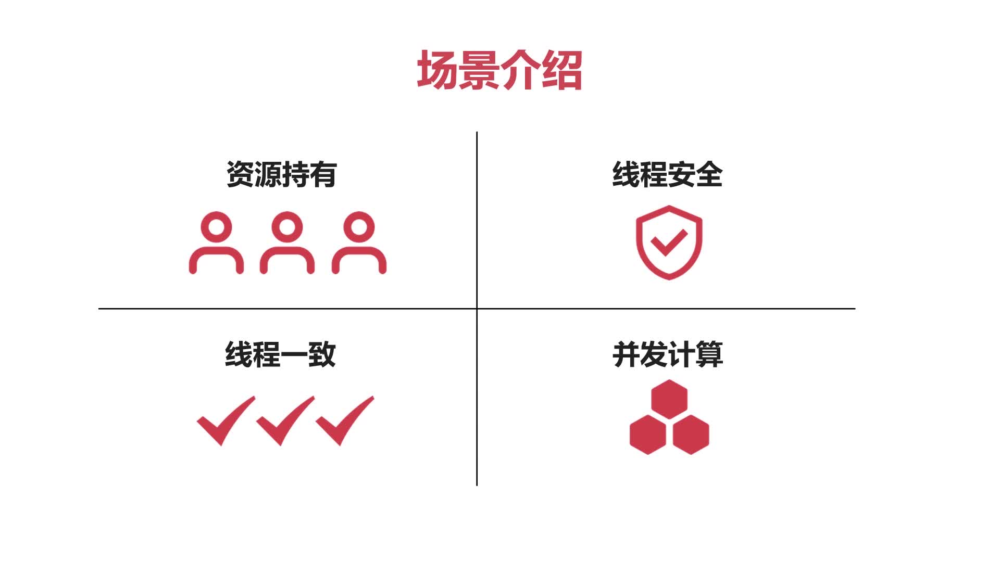

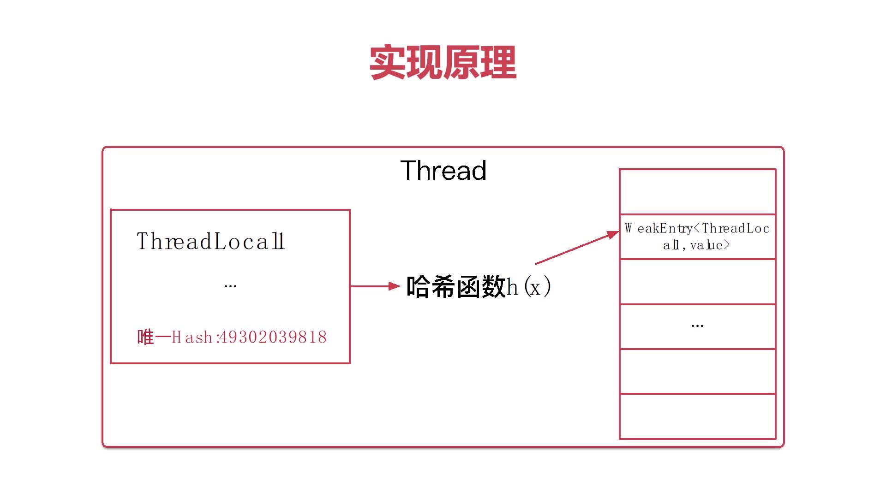

> 开箱即用，代码写出来是为了阅读，偶尔用于执行。

## 2. 基本 API

- 构造函数 `ThreadLocal<T>()`
- 初始化 `initialValue()`
- 访问器 `get` / `set`
- 回收 `remove`

<!-- 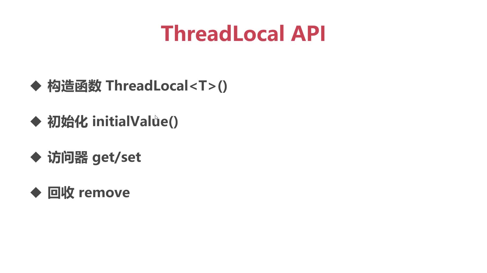 -->

```java
public class Basic {
    public static ThreadLocal<Long> x1 = new ThreadLocal<>();
    public static ThreadLocal<Long> x2 = ThreadLocal.withInitial(() -> {
        System.out.println("initialValue x2");
        return 100L;
    });
    public static ThreadLocal<Long> x3 = ThreadLocal.withInitial(() -> {
        System.out.println("initialValue x3");
        return Thread.currentThread().getId();
    });
}
```

```java
System.out.println(Basic.x1.get());
System.out.println("==========");
System.out.println(Basic.x2.get());
System.out.println(Basic.x2.get());
Basic.x2.set(101L);
System.out.println(Basic.x2.get());
System.out.println("==========");
System.out.println(Basic.x3.get());
new Thread(() -> System.out.println(Basic.x3.get())).start();
Basic.x3.set(102L);
System.out.println(Basic.x3.get());
Basic.x3.remove();
System.out.println(Basic.x3.get());
```

```java
null
==========
initialValue x2
100
100
101
==========
initialValue x3
1
102
initialValue x3
1
initialValue x3
14
```

## 3. 4 种类关键场景

### 3.1. 线程资源持有

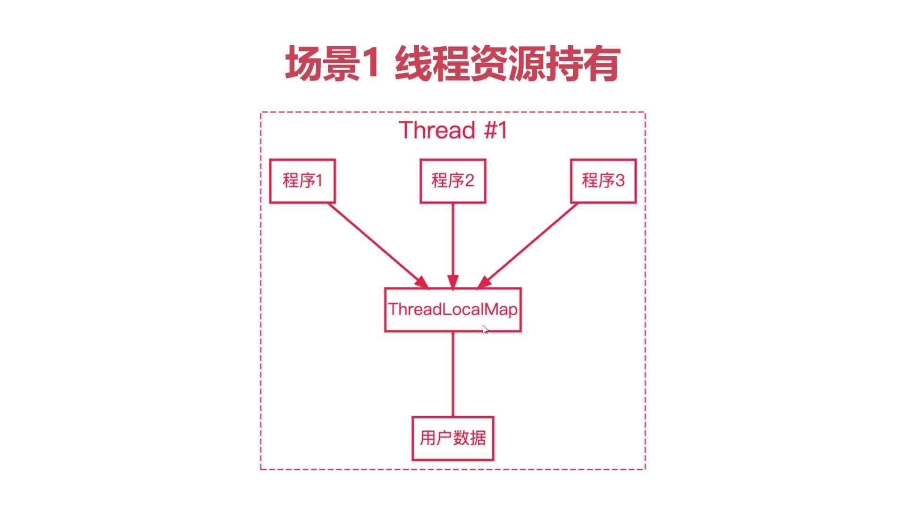

### 3.2. 线程资源一致性

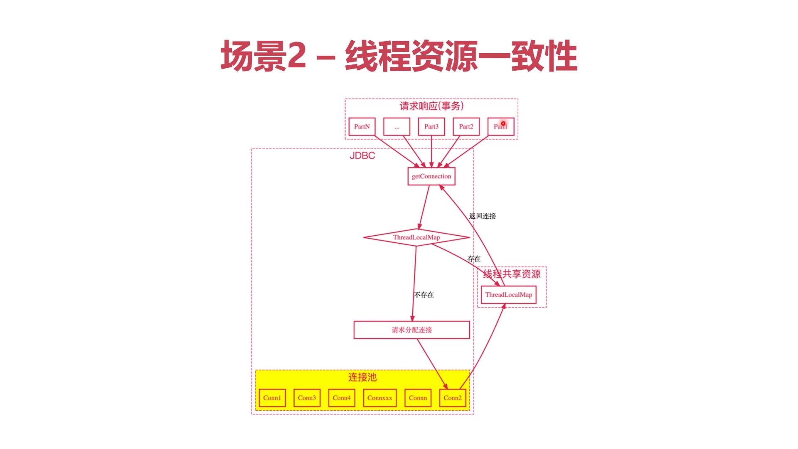

### 3.3. 线程安全

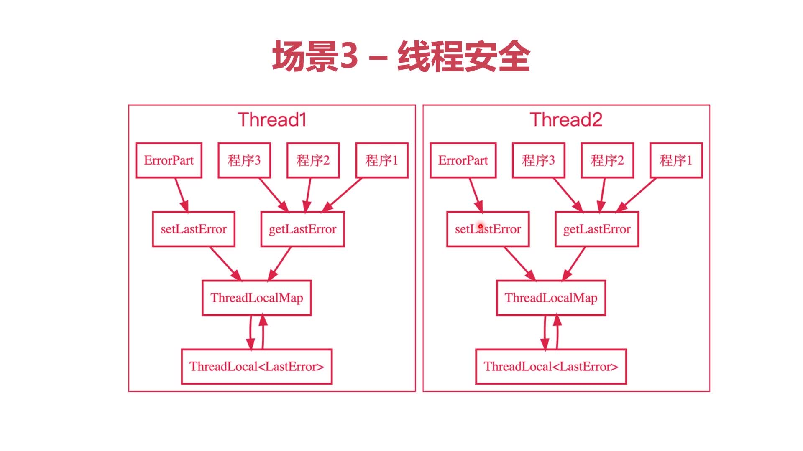

### 3.4. 分布式计算

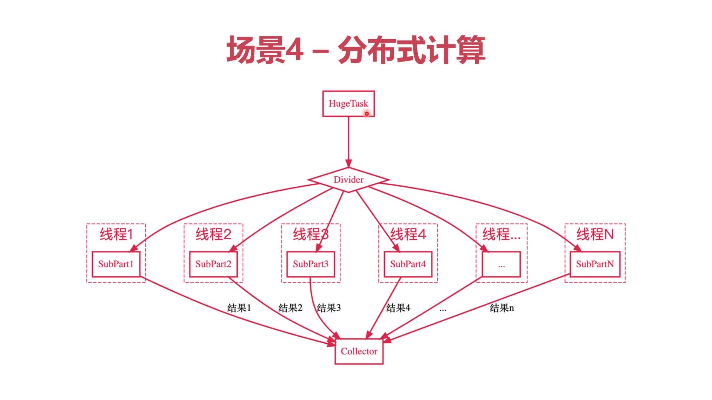

### 3.5. 总结

- 资源持有：持有线程资源供线程的各个部分使用，全局获取，减少**编程难度**
- 线程一致：帮助需要保持线程一致的资源（如数据库事务）维护一致性，降低**编程难度**
- 线程安全：帮助只考虑了单线程的程序库，无缝向多线程场景迁移
- 分布式计算：帮助分布式计算场景的各个线程累计局部计算结果

## 4. 并发场景分析

### 4.1. QPS 压测统计接口

- 观察：200QPS 下 Spring 框架的执行情况
- 目标：理解并发、竞争条件、临界区等概念
- 代表场景：交易场景

```java
@SpringBootApplication
public class Application {
    public static void main(String[] args) {
        SpringApplication.run(Application.class);
    }
}
```

```java
@RestController
public class StatController {
    static Integer c = 0;
    @RequestMapping("/stat")
    public Integer stat() {
        return c;
    }
    @RequestMapping("/add")
    public Integer add() {
        c++;
        return 1;
    }
}
```

访问 url

```http
http://localhost:8080/add
```

```http
http://localhost:8080/stat
```

压力测试

```bash
sudo apt-get install apache2-utils
```

```bash
# 结果正确
ab -n 10000 -c 1 localhost:8080/add
curl localhost:8080/stat
```

```bash
# 结果错误
ab -n 10000 -c 100 localhost:8080/add
curl localhost:8080/stat
```

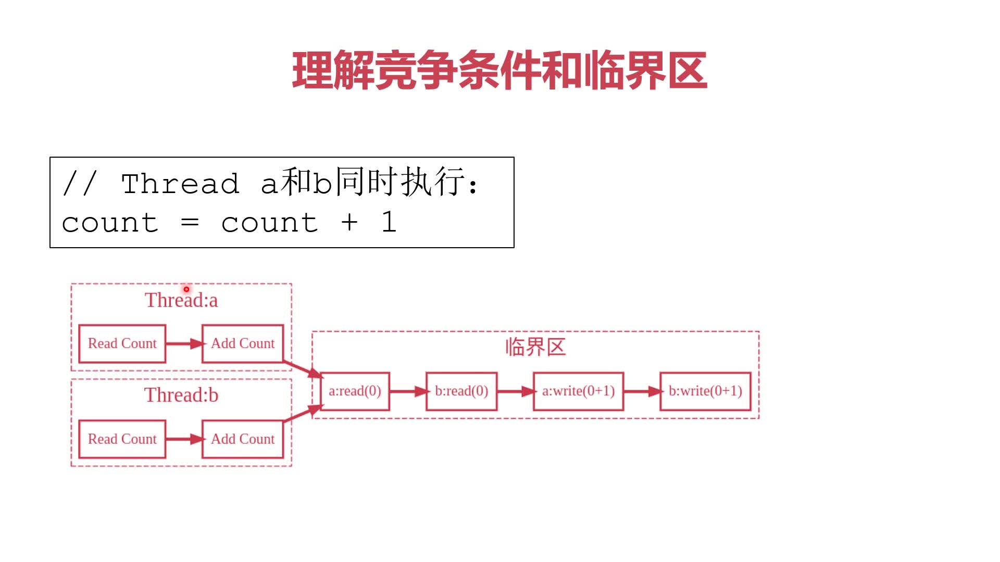

- 并发：多个程序**同时执行**
- 竞争条件：多个进程（线程）同时访问**同一个内存资源**，最终的执行结果依赖于多个进程（线程）执行的**精确时序**
- 临界区：访问共享内存的程序片段

<!-- 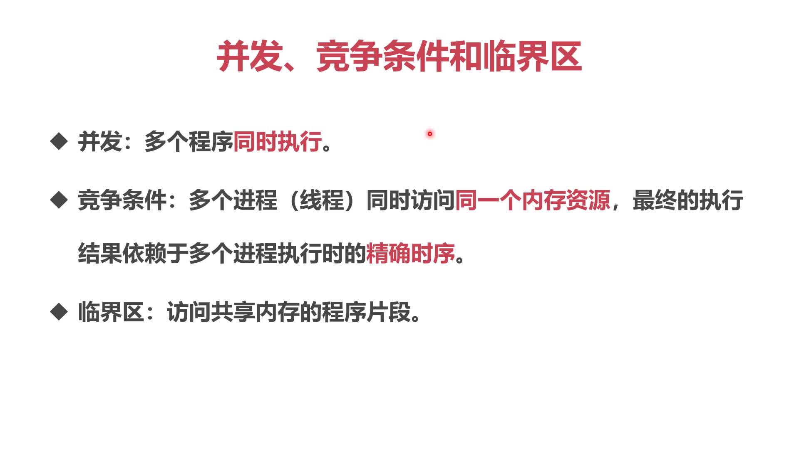 -->

### 4.2. 模拟程序执行过程

```java
static Integer c = 0;
@RequestMapping("/stat2")
public Integer stat() {
    return c;
}
@RequestMapping("/add2")
public Integer add() throws InterruptedException {
    // 模拟程序执行过程，如连接数据库等耗时操作
    Thread.sleep(100L);
    c++;
    return 1;
}
```

```bash
# 结果错误
ab -n 1000 -c 100 localhost:8080/add2
curl localhost:8080/stat2
```

### 4.3. 加锁

```java
static Integer c = 0;
@RequestMapping("/stat3")
public Integer stat() {
    return c;
}
synchronized void addOperation() throws InterruptedException {
    Thread.sleep(100L);
    c++;
}
@RequestMapping("/add3")
public Integer add() throws InterruptedException {
    this.addOperation();
    return 1;
}
```

```bash
# 结果正确，但非常耗时
ab -n 1000 -c 100 localhost:8080/add3
curl localhost:8080/stat3
```

### 4.4. 使用 ThreadLocal

```java
static ThreadLocal<Integer> c = ThreadLocal.withInitial(() -> 0);
void addOperation() throws InterruptedException {
    Thread.sleep(100L);
    c.set(c.get() + 1);
}
@RequestMapping("/add4")
public Integer add() throws InterruptedException {
    this.addOperation();
    return 1;
}
@RequestMapping("/stat4")
public Integer stat() {
    return c.get();
}
```

```bash
# 结果有点问题
ab -n 10000 -c 100 localhost:8080/add4
curl localhost:8080/stat4
```

- 基于线程池模型 synchronize（排队操作很**危险**）
- 用 ThreadLocal 收集数据很快速且安全
- 思考：如何在多个 ThreadLocal 中收集数据？

<!-- 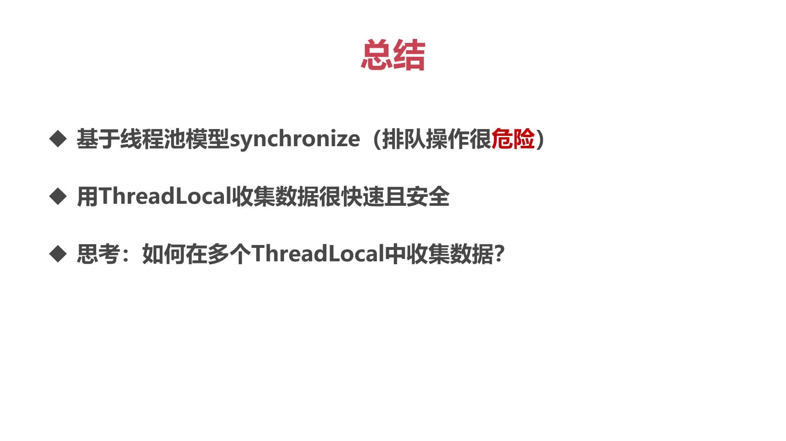 -->

### 4.5. ThreadLocal 同步

```java
@RestController
public class Stat5Controller {
    // static Map<Thread, Integer> map = new HashMap<>();
    // 我们要同时将 Integer 存在 ThreadLocal 和 Map 里，应该是引用类型
    // static Map<Thread, Val<Integer>> map2 = new HashMap<>();
    // 只需要 Set 就可以了
    static Set<Val<Integer>> set = new HashSet<>();
    synchronized static void addSet(Val<Integer> v) {
        set.add(v);
    }
    static ThreadLocal<Val<Integer>> c = ThreadLocal.withInitial(() -> {
        Val<Integer> v = new Val<>();
        v.set(0);
        addSet(v);
        return v;
    });
    void addOperation() throws InterruptedException {
        Thread.sleep(100L);
        Val<Integer> v = c.get();
        v.set(v.get() + 1);
    }
    @RequestMapping("/add5")
    public Integer add() throws InterruptedException {
        this.addOperation();
        return 1;
    }
    @RequestMapping("/stat5")
    public Integer stat() {
        return set.stream().map(Val::get).reduce(Integer::sum).orElse(0);
        // return set.stream().map(x -> x.get()).reduce((a, x) -> a + x).get();
    }
}
```

```java
public class Val<T> {
    T v;
    public void set(T v) {
        this.v = v;
    }
    public T get() {
        return v;
    }
    @Override
    public boolean equals(Object o) {
        return super.equals(o);
    }
    @Override
    public int hashCode() {
        return Objects.hash(v);
    }
}
```

```bash
# 结果正确
ab -n 10000 -c 200 localhost:8080/add5
curl localhost:8080/stat5
```

- 完全避免同步
- 缩小同步范围（简单）+ ThreadLocal 解决问题
- 思考：还可以用在哪些场景

<!--  -->

## 5. 大神们怎么用

### 5.1. 源码分析 01-Quartz:SimpleSemaphore

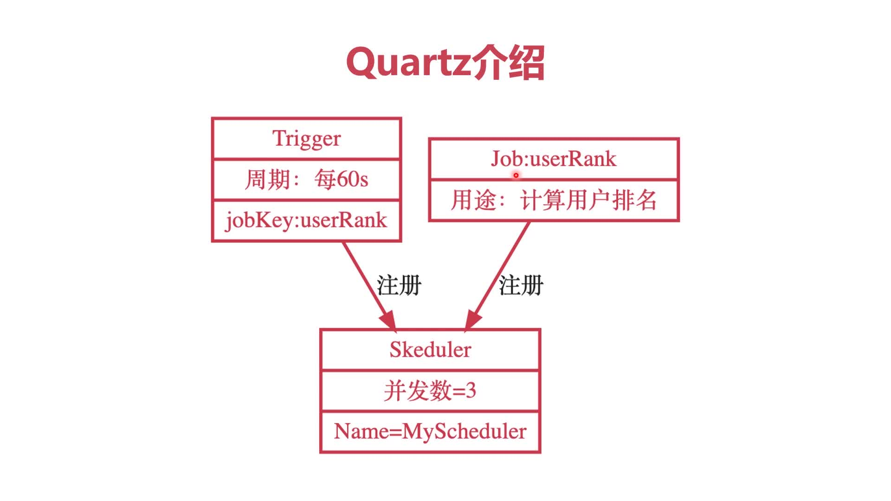

- Quartz 的 SimpleSemaphore 提供资源隔离
- SimpleSemaphore 中的 lockOwners 为重度锁操作前置过滤
- 思考：学易，用难！

<!-- 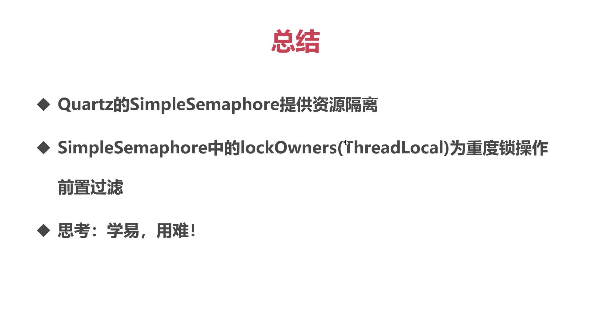 -->

### 5.2. 源码分析 02-Mybatis 框架保持连接池线程一致

- 原子性（**A**, Atomic）：操作不可分割
- 一致性（**C**, Consistency）：任何时刻数据都能保持一致
- 隔离性（**I**, Isolation）：多事务并发执行的时序不影响结果
- 持久性（**D**, Durability）：对数据结构的存储是永久的

Mybatis 的 SqlSessionManager

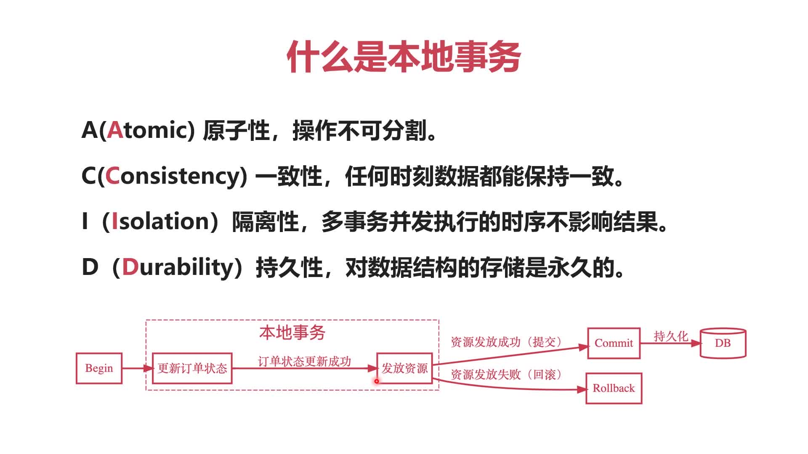

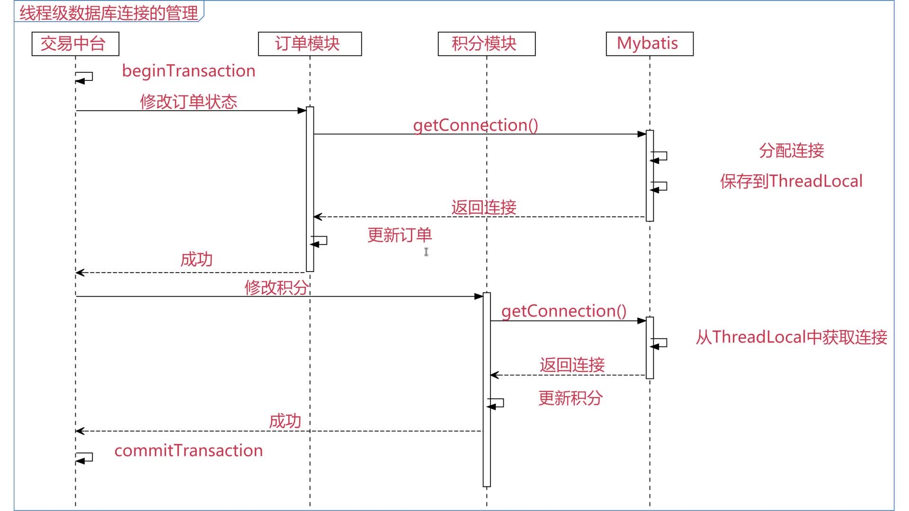

### 5.3. 源码分析 03-Spring 框架对分布式事务的支持

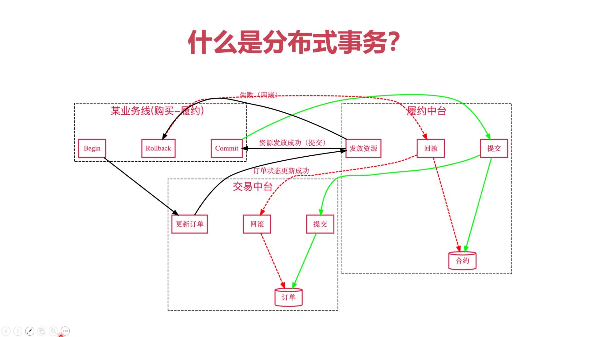

Spring 的 TransactionContextHolder

内部定义了一个 `ThreadLocal<TransactionContext>` 对象用户保存每个线程中自己的 `TransactionContext`。

## 6. 源码实现

### 6.1. 实现自己的 ThreadLocal

使用

```java
static MyThreadLocal<Long> myThreadLocal = new MyThreadLocal<>() {
    @Override
    protected Long initialValue() {
        return Thread.currentThread().getId();
    }
};
```

```java
for (int i = 0; i < 100; i++) {
    new Thread(() -> {
        System.out.println(myThreadLocal.get());
    }).start();
}
```

设计

```java
public class MyThreadLocal<T> {
    static Map<Thread, Map<MyThreadLocal<?>, Object>> threadLocalMap = new HashMap<>();
    synchronized public static Map<MyThreadLocal<?>, Object> getMap() {
        var thread = Thread.currentThread();
        if (!threadLocalMap.containsKey(thread)) {
            threadLocalMap.put(thread, new HashMap<MyThreadLocal<?>, Object>());
        }
        return threadLocalMap.get(thread);
    }
    protected T initialValue() {
        return null;
    }
    public T get() {
        var map = getMap();
        if (!map.containsKey(this)) {
            map.put(this, initialValue());
        }
        return (T) map.get(this);
    }
    public void set(T v) {
        var map = getMap();
        map.put(this, v);
    }
    // ...
}
```

问题：HashMap 中直接存储了 MyThreadLocal 的引用，导致内存无法回收。

思考：可以用整数 ID 替代对 MyThreadLocal 引用。

重新设计

```java
public class MyThreadLocal2<T> {
    static AtomicInteger atomic = new AtomicInteger();
    Integer threadLocalHash = atomic.addAndGet(0x61788647);
    static Map<Thread, Map<Integer, Object>> threadLocalMap = new HashMap<>();
    synchronized public static Map<Integer, Object> getMap() {
        var thread = Thread.currentThread();
        if (!threadLocalMap.containsKey(thread)) {
            threadLocalMap.put(thread, new HashMap<Integer, Object>());
        }
        return threadLocalMap.get(thread);
    }
    protected T initialValue() {
        return null;
    }
    public T get() {
        var map = getMap();
        if (!map.containsKey(this.threadLocalHash)) {
            map.put(this.threadLocalHash, initialValue());
        }
        return (T) map.get(this.threadLocalHash);
    }
    public void set(T v) {
        var map = getMap();
        map.put(this.threadLocalHash, v);
    }
}
```

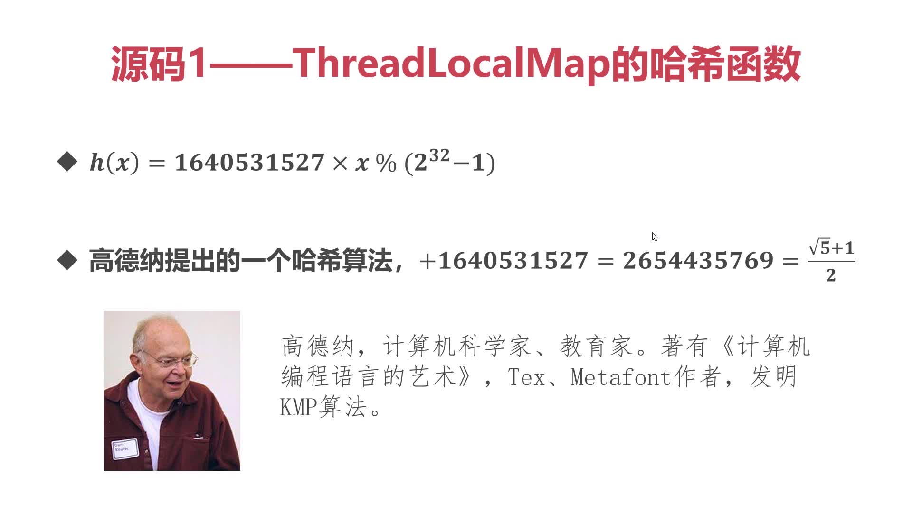

问题：

- HashMap 无限增加
- 初始空间分配是否合理
- 性能是否 OK

### 6.2. HashTable

哈希表（散列，HashTable）根据键（key）访问、设置内存中存储的位置的值。

<!--  -->

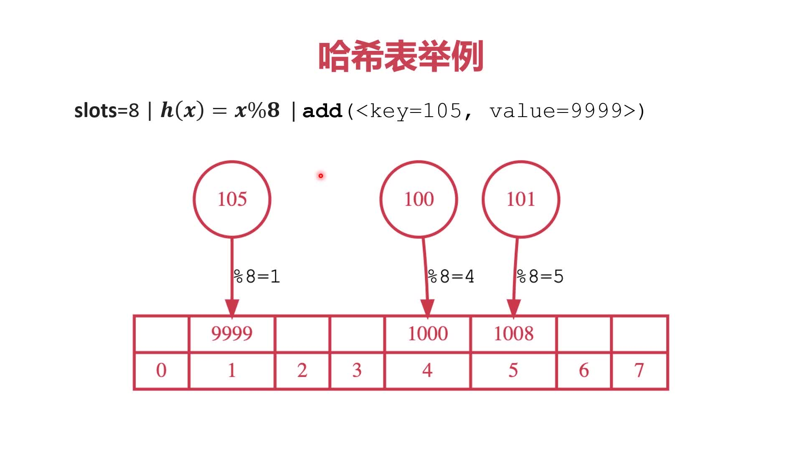

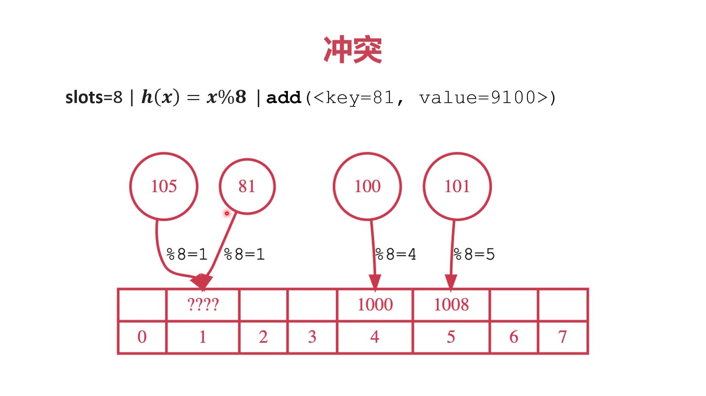

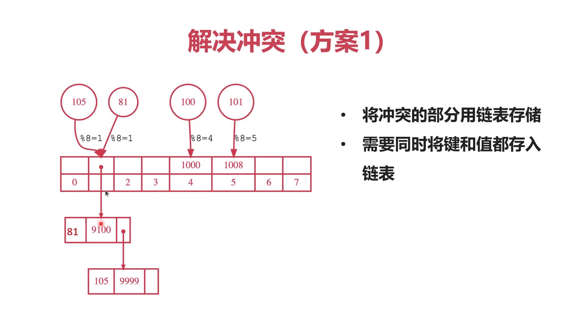

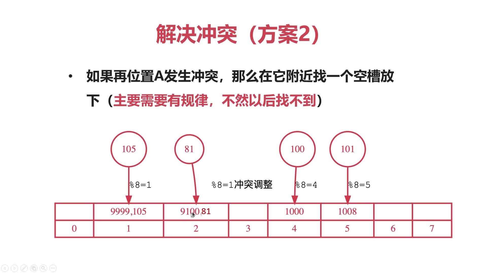

思考：

- 冲突可以避免吗？让槽很大，key 的范围很小不久行了？（思考对还是不对）
- 怎样的哈希函数好？举一个每次都冲突的哈希表例子，并说出危害

<!--  -->

### 6.3. ThreadLocal 源码分析

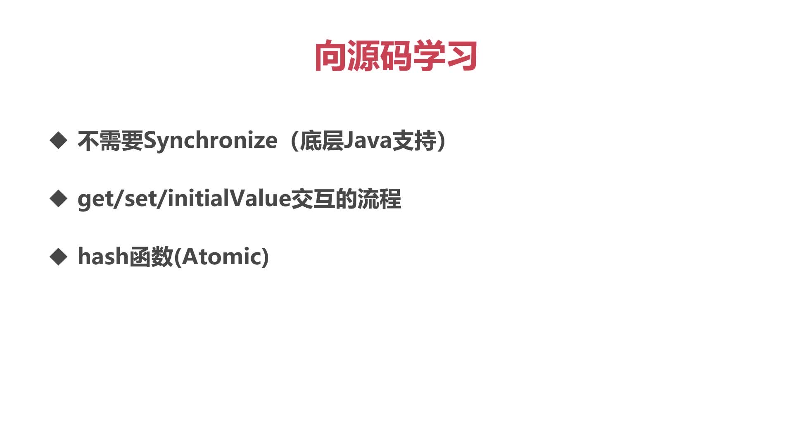

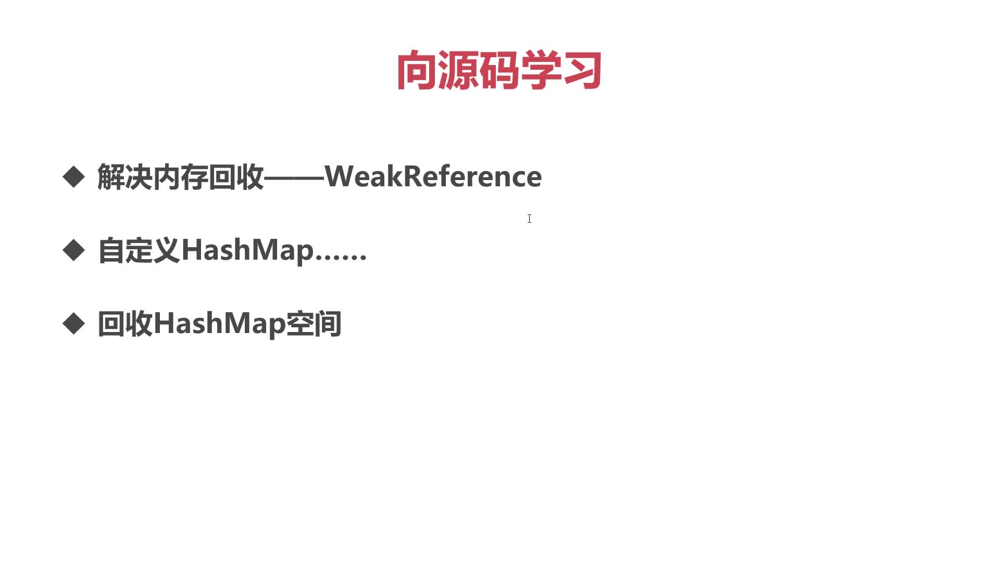

## 7. 总结


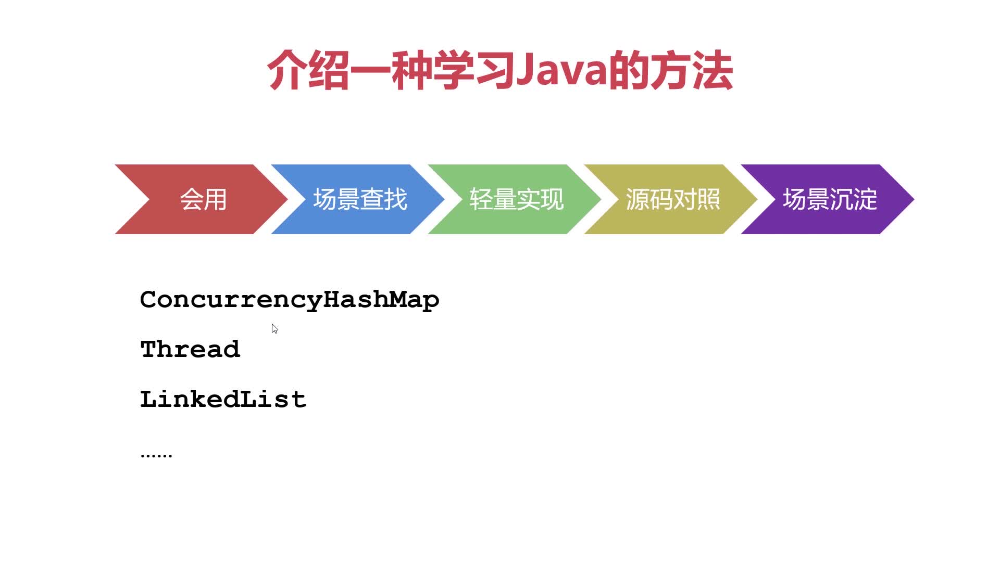

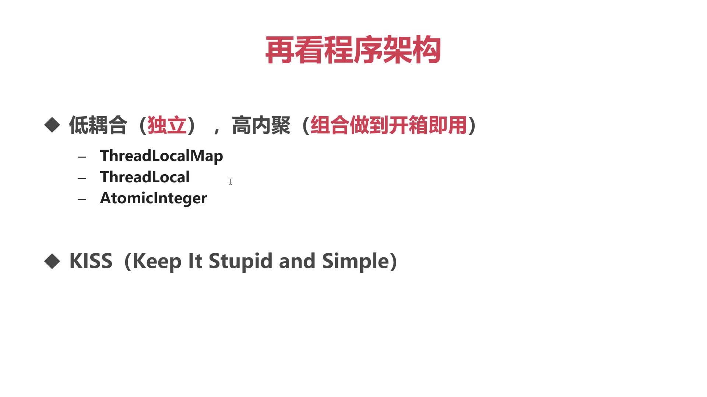


